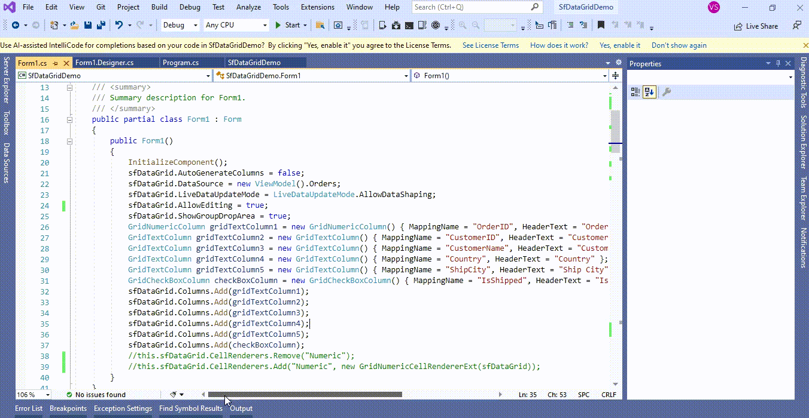

# How to place the cursor while editing in GridNumericColumn in WinForms DataGrid (SfDataGrid)?

## About the sample
This example illustrates how to place the cursor while editing in GridNumericColumn in [WinForms DataGrid](https://www.syncfusion.com/winforms-ui-controls/datagrid) (SfDataGrid)? 

[WinForms DataGrid](https://www.syncfusion.com/winforms-ui-controls/datagrid) (SfDataGrid) enters into editing in [GridNumericColumn](https://help.syncfusion.com/cr/windowsforms/Syncfusion.WinForms.DataGrid.GridNumericColumn.html) places the cursor at the last of the edit element. You can places the cursor based on the entered number in a cell by overriding the [OnInitializeEditElement](https://help.syncfusion.com/cr/windowsforms/Syncfusion.WinForms.DataGrid.Renderers.GridNumericCellRenderer.html#Syncfusion_WinForms_DataGrid_Renderers_GridNumericCellRenderer_OnInitializeEditElement_Syncfusion_WinForms_DataGrid_DataColumnBase_Syncfusion_WinForms_GridCommon_ScrollAxis_RowColumnIndex_Syncfusion_WinForms_Input_SfNumericTextBox_) method in [GridNumericCellRenderer](https://help.syncfusion.com/cr/windowsforms/Syncfusion.WinForms.DataGrid.Renderers.GridNumericCellRenderer.html).

```C#

this.sfDataGrid.CellRenderers.Remove("Numeric");
this.sfDataGrid.CellRenderers.Add("Numeric", new GridNumericCellRendererExt(sfDataGrid));

public class GridNumericCellRendererExt : GridNumericCellRenderer
{
        private SfDataGrid dataGrid;

        public GridNumericCellRendererExt(SfDataGrid dataGrid) : base()
        {
            this.dataGrid = dataGrid;
        }

        protected override void OnInitializeEditElement(DataColumnBase column, RowColumnIndex rowColumnIndex, SfNumericTextBox uiElement)
        {
            base.OnInitializeEditElement(column, rowColumnIndex, uiElement);
            // Below code is used to set caret position based on mouse position
            switch (dataGrid.EditorSelectionBehavior)
            {
                case EditorSelectionBehavior.Default:
                    uiElement.SelectionStart = 1;
                    uiElement.SelectionLength = 0;
                    break;
                case EditorSelectionBehavior.SelectAll:
                    uiElement.SelectAll();
                    break;

                case EditorSelectionBehavior.MoveLast:
                    uiElement.SelectionStart = uiElement.Text.Length;
                    uiElement.SelectionLength = 0;
                    break;
            }
        }
}

```



Take a moment to peruse the [WinForms DataGrid - Editing](https://help.syncfusion.com/windowsforms/datagrid/editing) documentation, where you can find about editing with code examples.

## Requirements to run the demo
Visual Studio 2015 and above versions
